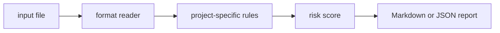

# feature-flag-sweeper

`feature-flag-sweeper` is a small local CLI that find stale and risky feature flags in config inventories.

## Why it is useful

Feature flags are easy to add and hard to remove. This CLI highlights flags that need cleanup before they become hidden product logic.

## Key features

- reads text, JSON, JSONL, or CSV inputs
- returns Markdown or JSON reports
- supports severity-based CI exit codes
- keeps all checks deterministic and offline
- includes focused rules for this project:
- `ownerless-flag`: feature flag has no owner
- `permanent-flag`: flag has no cleanup date
- `global-enabled`: flag appears globally enabled

## Installation

```bash
python -m pip install -e ".[dev]"
```

## Usage

```bash
feature-flag-sweeper examples/sample.txt
feature-flag-sweeper examples/sample.txt --json
feature-flag-sweeper path/to/input.txt --fail-on medium --out report.md
python -m feature_flag_sweeper --help
```

Example input:

```text
flag old_checkout enabled true created 2023 owner unknown permanent
```

## CLI options

```text
feature-flag-sweeper INPUT [--format auto|text|jsonl|csv|json] [--json]
             [--fail-on low|medium|high] [--out PATH]
```

`INPUT` is any feature flag inventory text or CSV export. The tool exits with code `2` when findings meet the selected
threshold, which makes it easy to use in GitHub Actions or release checks.

## Workflow



## Tests

```bash
ruff check .
pytest
python -m feature_flag_sweeper --help
```

## License

MIT
