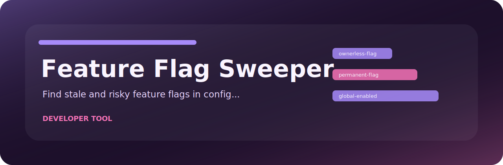
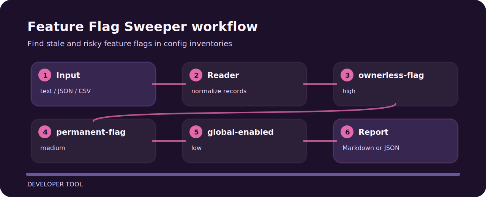

# Feature Flag Sweeper



This repository turns a tiny plain text into reviewable signals for feature flags.

## Inspection line



## Decision points

| Signal | Level | What it flags | Fix direction |
| --- | --- | --- | --- |
| `ownerless-flag` | high | feature flag has no owner | Assign a responsible owner before rollout. |
| `permanent-flag` | medium | flag has no cleanup date | Add an expiry date or removal ticket. |
| `global-enabled` | low | flag appears globally enabled | Confirm whether the flag can be removed. |

## Run the sample

```bash
git clone https://github.com/mertefekurt/feature-flag-sweeper.git
cd feature-flag-sweeper
python -m pip install -e ".[dev]"
feature-flag-sweeper examples/sample.txt
```
